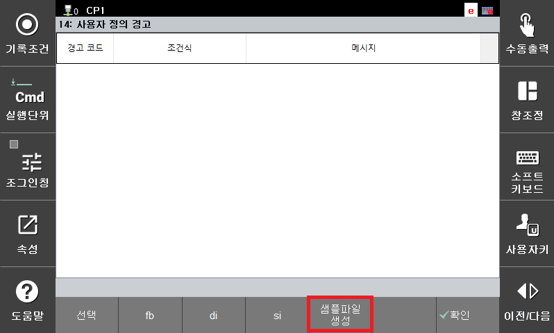
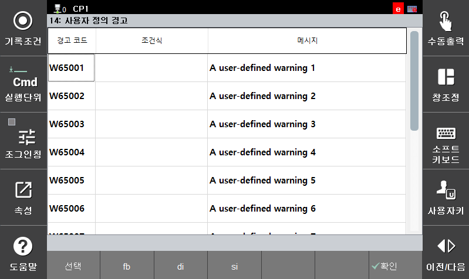
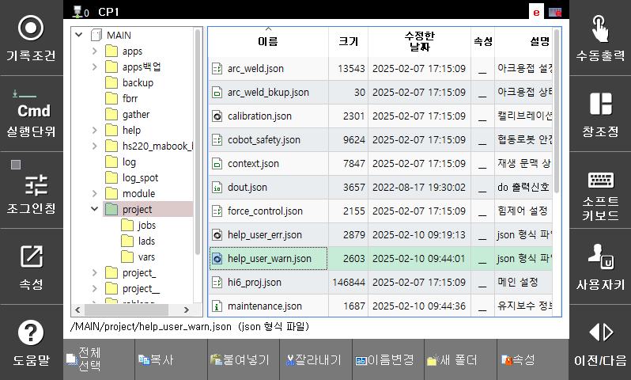
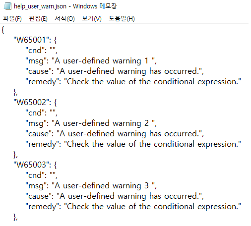

# 2.2 사용자 정의 경고 설정

1. \[시스템 &gt; 4: 응용 파라미터 &gt; 14: 사용자 정의 경고\] 메뉴를 터치하십시오.  
2. '샘플파일 생성' 버튼을 클릭하십시오. 
* MAIN/project 경로에 'help_user_warn.json' 파일이 생성됩니다.

 </img>
 <em>
그림 5 샘플파일 생성
</em>

3. 설정화면 재진입 시 샘플파일에 작성된 사용자 정의 경고가 표시됩니다.
-   경고 코드 : 발생시킬 경고 코드를 지정합니다.
-	조건식 : 해당 경고를 발생하기 위한 조건식을 지정합니다. 조건식은 if문에서 사용되는 조건식은 모두 가능합니다.
-	메시지 : 해당 경고가 발생할 때 출력되는 메시지를 지정합니다.

 </img>
 <em>
그림 6 사용자 정의 경고 샘플
</em>

4. 티칭 펜던트에 USB를 장착하고, 파일 관리자 메뉴로 진입하여 'help_user_warn.json' 파일을 USB 경로로 복사합니다.  

 </img>
 <em>
그림 7 사용자 정의 경고 설정 파일
</em>

5. PC에서 파일을 열고 정의할 경고를 샘플파일 양식에 맞게 편집합니다.(메모장으로 편집 가능)  

 </img>
 <em>
그림 8 사용자 정의 경고 편집
</em>

-   W65###: 경고 코드(설정 범위 W65001 ~ W65100)
-	cnd : 조건식
-	msg : 경고 도움말에 표시되는 원인 메시지
-   remedy : 경고 도움말에 표시되는 조치 방법

6. 편집된 파일을 다시 티칭 펜던트로 복사합니다.