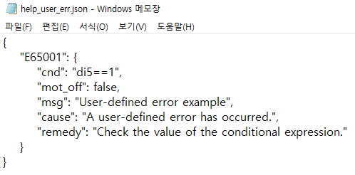
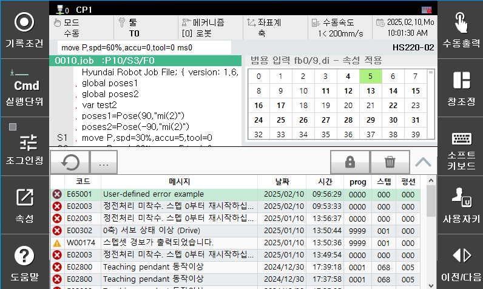
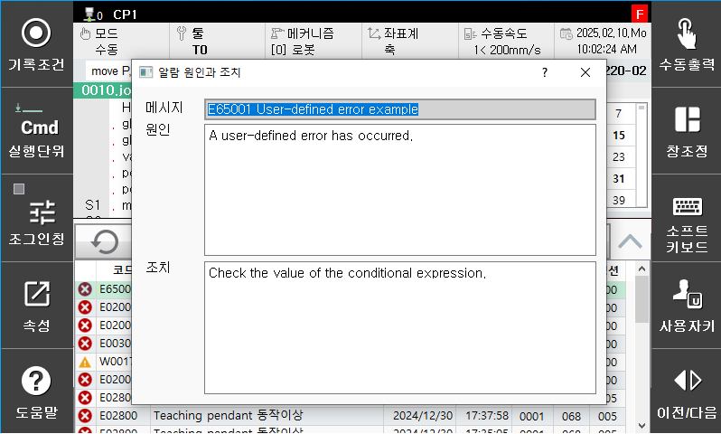

# 3.1 사용자 정의 에러 예제

1. 'help_user_err.json' 파일을 아래와 같이 수정합니다.

 </img>
 <em>
그림 9 샘플파일 생성
</em>

2. 조건식을 만족시키기 위해 di5번 신호를 on하면 E65001이 발생합니다.

 </img>
 <em>
그림 10 사용자 정의 에러 발생
</em>

3. 에러에 대한 도움말을 확인하면 작성한 내용과 동일한 내용을 확인할 수 있습니다.

 </img>
 <em>
그림 11 사용자 정의 에러 도움말
</em>

